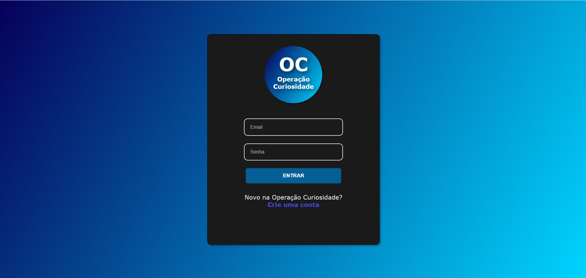
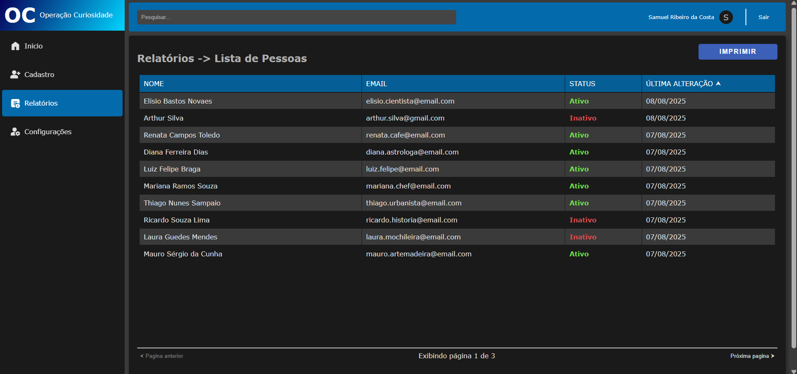
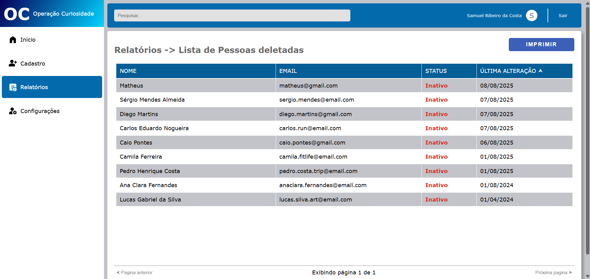
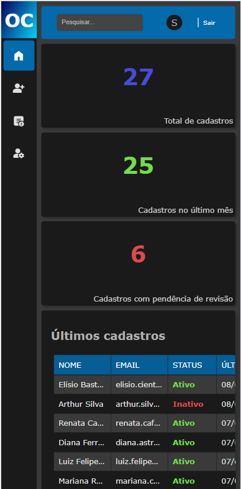

# 📝 Sistema de Cadastro e Gerenciamento de Pessoas

Projeto desenvolvido para estudos, com **frontend em HTML, CSS e JavaScript** e **backend em C# (.NET) utilizando arquitetura CQRS**.

O sistema permite **cadastro de usuários**, autenticação via **JWT** e CRUD completo de "Pessoas" (útil para fortalecer relações com clientes, fornecedores, colaboradores etc...), incluindo recursos de paginação, filtro e ordenação.  
Além disso, conta com funcionalidades de **logs**, **troca de tema** e **ajuste de tamanho de fonte**.

---

## 🚀 Tecnologias Utilizadas

### **Frontend**
- HTML5
- CSS3
- JavaScript

### **Backend**
- C# .NET
- Arquitetura CQRS
- JWT (JSON Web Token) para autenticação
- ASP.NET Web API
- XUnit para testes unitários
  
---

## 📚 Funcionalidades

- **Cadastro de Usuário** com autenticação
- **Login com JWT** e validação de token em quase todas as requisições
- **CRUD de Pessoas** (Clientes, Fornecedores, Colaboradores, etc..)
- **Paginação Avançada** com:
  - Filtros
  - Ordenação
  - Página atual
  - Tamanho de página
- **Logs** de operações
- **Troca de Tema** (claro/escuro)
- **Ajuste de Tamanho de Fonte** (pequeno, médio, grande)
- **Responsividade:** paginas visualizaveis em telas de computador e celular
---

## 🖼️ Prévia do Projeto

### Página de Login

### Listagem de Pessoas

### Tema Claro

### Telas Menores

---
